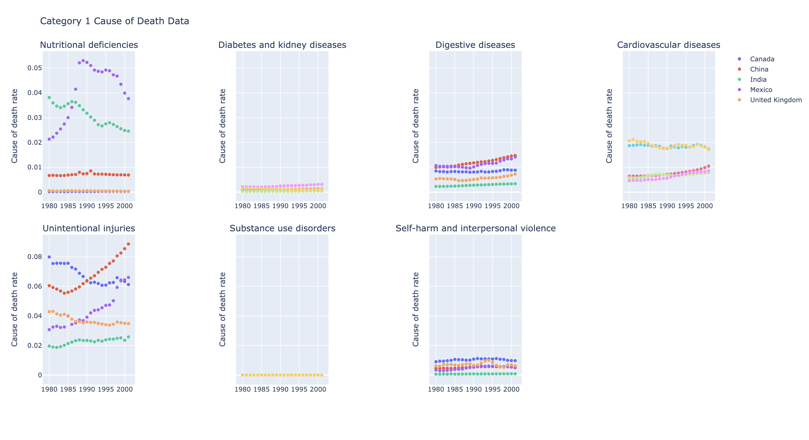
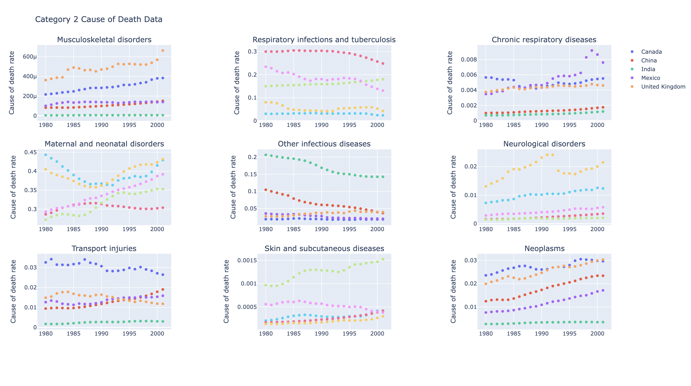
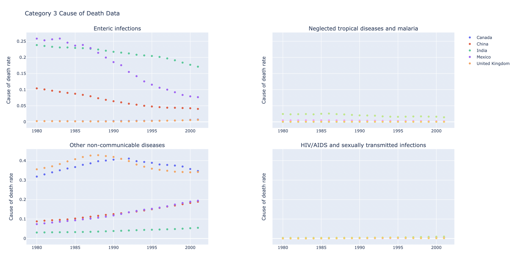
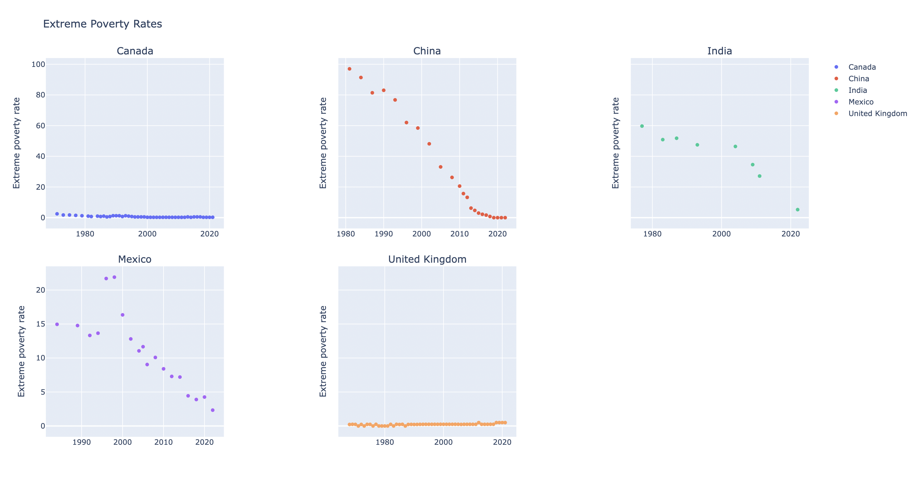

# Child Mortality Rate Analysis

## Group Members
- Serena Li
- Hussein Hirsi

## Colab Worksheet
- Colab Worksheet (Serena): [child_mortality_analysis](https://colab.research.google.com/drive/1mtLnA9waputmxI0OJQQwwtv-4PoL7d9c?usp=sharing)

## Introduction
Child mortality rate is defined as the probability of a child dying before reaching age five. It remains a key indicator of a country’s public health conditions and broader socio-economic development. In this project, we analyze historical trends in child mortality and explore whether economic development, measured by GDP per capita, is associated with lower child mortality across countries.  Moreover, we analyze the causes of child mortality and the relationship between child mortality and poverty in different countries. 

Four datasets from Our World in Data (OWID) were used:
- Child mortality rate: contains yearly child mortality rate for all countries
- Child mortality & GDP per capita: contains child mortality rates and GDP per capita for all countries
- Child Mortality vs Share in Extreme Poverty: Contains child mortality vs the percent in extreme poverty
- Causes of Death in Children Under 5: Shows numerous causes of deaths in children under 5

The main research questions are:
- How has child mortality changed over time from 1957 to 2023 for selected countries?
- Is there a correlation between GDP per capita and child mortality across countries?
- Is there a connection between the causes of child mortality and extreme poverty rates?

To address these questions, we follow these analytical approaches:
- Visualizing long-run trends in child mortality for selected countries using a line chart.
- Build a regression model to test for correlation between GDP per capita and child mortality rate in 2020. 

To see if there is a connection between causes of child mortality and extreme poverty I created multiple visualizations of line charts for different causes of child mortality and compared it to the extreme poverty rates to see if there was any correlation between the two.

## Methods & Results
### Part I
The first part of the analysis examines how child mortality has changed over time across selected countries. To achieve this, the dataset was filtered to include only observations from 1957 to 2023, in order to ensure a consistent time window. For this analysis, I selected seven countries to illustrate a range of economic and demographic contexts: the United States, Japan, China, India, Brazil, Nigeria, and Ethiopia. 
For each country, I used a for loop to subset the data and plot its annual child mortality rate across the selected time period. I put “year” on the x-axis, and “child mortality rate” on the y-axis, producing one line per country. The resulting line chart visualizes long-term trends in child mortality from 1957 to 2023. 

<iframe src="mortality_rate.html" width="100%" height="600" style="border:none;"> </iframe>

From the graph, we can see that all seven countries exhibit substantial declines in child mortality over the 66-year period. This reflects global improvements in healthcare, vaccination, nutrition and access to medical services. However, the magnitude, timing, and steepness of these declines differ across countries. 
High income countries such as Japan and the United States start with relatively low child mortality rates and experience steady declines, reaching near-zero levels by the 2000s. The sharp increase in China’s child mortality rate around 1960 corresponds to the Great Chinese Famine that took place from 1959 to 1961. Beginning in the 1960s, China showed a rapid decline in child mortality rate, which might be associated with major public health initiatives and accelerated economic development. Brazil and India also exhibit continuous downward trends, though at a slower pace compared to China. 
Nigeria and Ethiopia start with the highest mortality rates and experience more variable declines. Nigeria’s reduction is slower and remains substantially above the other countries throughout the entire period. Ethiopia shows irregular fluctuations early on, followed by a notable decline starting in the late 1980s. By 2023, both countries still maintain higher child mortality rates compared to the other countries.
Overall, the figure highlights global progress in reducing child mortality from 1957 to 2023. While all countries move in the same downward direction, the large gaps between high-income and low-income countries remain evident throughout the entire period. 

### Part II
For finding a connection between extreme poverty rates and child mortality causes I first started with loading the data into a colab with the idea to merge them. Before I could, the dataset containing the extreme poverty rates had a lot of missing data that I needed to figure out what to do with. I decided to filter past the year 1950 and then drop any missing data from the extreme poverty column. Next I removed any entries that were duplicates or unneeded. The second dataset containing information on causes of child mortality was completely intact, but due to a limit on exporting I was only able to get the year up to 2001. With both datasets cleaned I decided to merge the two.
With the datasets merged I was then ready to create a visualization. This was something that stumped me for a while as I was considering the different ways to display data like the extreme poverty rates and cause of death rates for each cause of death. This information was gonna be displayed for each country so because of how many parts were involved I settled on categorizing the causes of death from 1-3 based on how preventable the cause is financially. Each cause was assigned a category which was mapped as a column in the dataframe. This is where I began to face a lot of difficulties with my code. For starters, I had originally planned to group countries by region and year, aggregate and average the data for the countries in each region, and then display the regional data. For some reason however when I averaged the data the entries, regardless of the year, we’re all the same thing. I couldn’t figure out how to fix this so I ended up downsizing to just one region, had the same issue, and ended up just examining a handful of random countries.

For each subplot I planned on making I made a filtered version of the dataframe containing entries relating to one of the 3 categories for causes of deaths. I then tried to play around with adding the traces using a for loop to avoid adding them individually but had trouble and eventually just used AI to make it for me. I also decided to make a separate subplot containing the extreme poverty rates for comparison. The idea was to compare the categorized causes of death subplots to the extreme poverty 
rates and see if any countries had any correlations. Some of the subplots came out like:

The way I actually viewed the cause of death subplot and the subplot for the poverty rates was through the use of monitors so I can see them side by side. Some issues I couldn’t really solve with the United Kingdom’s poverty rate having 0’s where the value just drops and because of the way the time frames line up most of the extreme poverty data past 2000 didn’t line up with the causes of death. This has to do with the way the cause of deaths dataframe was exported.
Analyzing the data there was definitely variation in what causes of child mortality have a correlation with the extreme poverty rate of the country. In places like the UK, Canada, and India there seemed to be a correlation between the poverty rate and mortality rate for nutritional deficiencies. In some cases like with self harm, neurological disorders, and transport injuries the child mortality rate didn’t really correlate with a poverty rate, but was somewhat low across all countries. We can see something similar with the STI’s death rate all being close for different countries despite differing poverty rates.  With digestive diseases, Mexico, Canada, and India all followed a similar trend of increasing despite having a decreasing poverty rate.There were also some causes like unintentional injuries that made me question how it could be related to a country's poverty rate 

### Part III
The third part examines the relationship between economic development and child mortality. For simplicity, I filtered the dataset so it contains only the data from the year 2020, which is the most recent year with comprehensive global data. Then, I removed entries without an ISO country code to exclude aggregate regions such as Asia, European Union. Next, I removed rows that contained missing or non-numeric values in either “GDP per capita” or “Child mortality rate”, and both variables were converted into numeric variables. Observations with a GDP per capita of zero were also excluded, since later procedures require positive values. After these steps, the 2020 samples consisted of 163 countries. 
I created a scatter plot with GDP per capita on the x-axis and child mortality rate on the y-axis. From the graph, we can see a clear negative association between the two variables: countries with higher GDP per capita tend to have lower child mortality rates. 

<iframe src="mortality_GDP.html" width="100%" height="600" style="border:none;"> </iframe>
To quantify this relationship, I built an ordinary least squares (OLS) regression model. In this mode, the child mortality rate was regressed on the logarithm of GDP per capita. The regression results indicate a strong and statistically significant negative relationship. The coefficient on log GDP per capita is -1.8449 (p < 0.001), implying that higher GDP levels are associated with lower child mortality rates. The model explains 60.6% of the cross-country variation (R^2 = 0.606), suggesting that economic development is a major predictor of global disparities in child mortality. 

<iframe src="mortality_regression.html" width="100%" height="600" style="border:none;"> </iframe>

## Conclusion
#### Key Findings
- Child mortality rate has decreased from 1957 to 2023 across countries, but there are still differences between low-income and high-income countries.
- GDP per capita is strongly and significantly associated with child mortality rate. Both the visualization and the regression model presents a negative correlation. 
- For some causes you could definitely argue that there is a correlation between the cause of death and extreme poverty rate, while others not so much like transportation injuries for example. 
- Some countries can follow a similar trend for a mortality rate regardless of what they’re extreme poverty rate is.

### Limitations & Future Research
While the model explains a large share of variation, it cannot establish causality; it does not capture the full range of social, political, and healthcare factors that influence child mortality. Moreover, the second part only investigates data from the year 2020, which limits the ability to account for changes within countries over time. Further research could incorporate additional variables, such as vaccination rate and healthcare spending, to present a more comprehensive analysis. Despite these limitations, the findings support the broader conclusion that economic development plays an important role in shaping global disparities in child mortality rates. 
While I was able to find correlations between some countries' extreme poverty rate and a cause of child mortality, it was hard to find enough data to support some of the trends. There was a lot of missing data from the extreme poverty data set and it didn’t quite line up with the causes of child mortality. Additionally, given how we’re examining poverty and child mortality rates for countries over time, there are definitely outside factors that aren’t being taken into consideration. Some of the areas of future research I think would be  interesting to see would be examining just infections and sicknesses and seeing which countries follow similar trends or even taking the regional approach and comparing countries within a specific region of the world.

